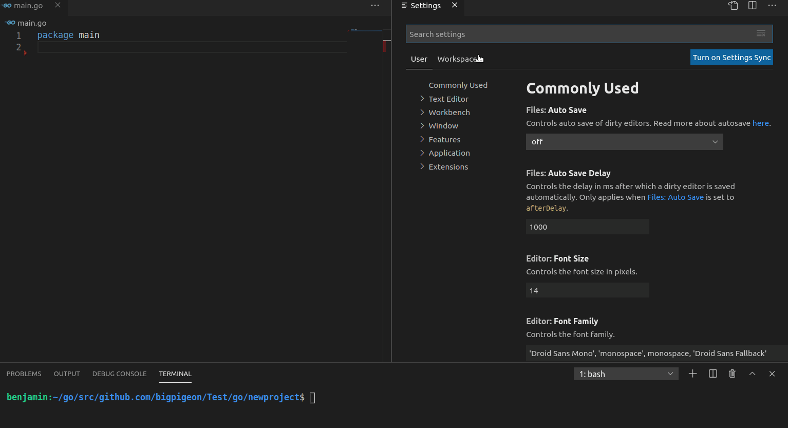

# tagfmt

[](https://goreportcard.com/report/github.com/bigpigeon/tagfmt)
[](https://travis-ci.org/bigpigeon/tagfmt)
[](https://codecov.io/gh/bigpigeon/tagfmt)

Tagfmt formats struct tag within Go programs.

It uses blanks for alignment. tag must be in key:"value" pair format

tagfmt feature:

- align field tags in part 
- fill specified tag key to field
- sort field tags


## get tagfmt 

you can download from github releases

https://github.com/bigpigeon/tagfmt/releases

or go get 

    go get github.com/bigpigeon/tagfmt

## usage 
```
usage: tagfmt [flags] [path ...]
  -P string
        field name with inverse regular expression pattern
  -a    align with nearby field's tag (default true)
  -cpuprofile string
        write cpu profile to this file
  -d    display diffs instead of rewriting files
  -e    report all errors (not just the first 10 on different lines)
  -f string
        fill key and value for field e.g json=lower(_val)|yaml=snake(_val)
  -l    list files whose formatting differs from tagfmt's
  -p string
        field name with regular expression pattern (default ".*")
  -s    sort struct tag by key
  -sP string
        struct name with inverse regular expression pattern
  -so string
        sort struct tag keys order e.g json|yaml|desc
  -sp string
        struct name with regular expression pattern (default ".*")
  -sw string
        sort struct tag keys weight e.g json=1|yaml=2|desc=-1 the higher weight, the higher the ranking, default keys weight is 0
  -w    write result to (source) file instead of stdout

```

## use in vscode

1. install filewatcher extension first
2. edit filewatcher settings
3. add sub item to `filewatcher.commands`, and then save it
4. open the go file, add struct field and then save it

```
{
   "match": "\\.go",
   "isAsync": true,
   "event": "onFileChange",
   "cmd": "tagfmt -w -f \"json=or(:tag,snake(:field))|yaml=or(:tag,lower_camel(:field))\" ${file} -s -so \"json|yaml\" ${file} " 
}
``` 




## tag align 

align tag according to the longest tag's object of each column

```go 
// tagfmt .
package main
type Example struct {
	Data      string `xml:"data" yaml:"data"  json:"data"`
	OtherData string `xml:"other_data" json:"other_data:omitempty" yaml:"other_data"`
}
```
the result
```go
// tagfmt 
package main

type Example struct {
	Data      string `xml:"data"       yaml:"data"                 json:"data"`
	OtherData string `xml:"other_data" json:"other_data:omitempty" yaml:"other_data"`
}
```

space line or no tag's field will split this rule, just like struct field align by gofmt

```go 
//tagfmt
package main
type Example struct {
	Data string `xml:"data" yaml:"data,omitempty"  json:"data"`
	OtherData string `xml:"other_data" json:"other_data" yaml:"other_data"`

    NewLineData string `xml:"new_line_data" yaml:"new_line_data" json:"new_line_data"`
    NewLineOtherData string `xml:"new_line_other_data" yaml:"new_line_other_data"  json:"new_line_other_data"`
}
// after format
package main

type Example struct {
	Data      string `xml:"data"       yaml:"data,omitempty" json:"data"`
	OtherData string `xml:"other_data" json:"other_data"     yaml:"other_data"`

	NewLineData      string `xml:"new_line_data"       yaml:"new_line_data"       json:"new_line_data"`
	NewLineOtherData string `xml:"new_line_other_data" yaml:"new_line_other_data" json:"new_line_other_data"`
}
```

## tag fill

tag fill can fill specified key to field tag

e.g 
```
//tagfmt -f "json=:field"

type OrderDetail struct {
	ID       string   ``
	UserName string   `json:"name"`
	OrderID  string   `json:"order"`
	Callback string   ``
	Address  []string ``
}
// after format
package main

type OrderDetail struct {
	ID       string   `json:"ID"`
	UserName string   `json:"name"`
	OrderID  string   `json:"order"`
	Callback string   `json:"callback"`
	Address  []string `json:"address"`
}
```

if you didn't want to change the existing tag, use 'or' function

```
//tagfmt -f "json=or(:tag, :field)"

type OrderDetail struct {
	ID       string   ``
	UserName string   `json:"name"`
	OrderID  string   `json:"order"`
	Callback string   ``
	Address  []string ``
}
// after format
package main

type OrderDetail struct {
	ID       string   `json:"ID"`
	UserName string   `json:"name"`
	OrderID  string   `json:"order"`
	Callback string   `json:"Callback"`
	Address  []string `json:"Address"`
}
```

and then I hope the tag convert to snake case style, use snake

```
//tagfmt -f "json=or(:tag, snake(:field))"
type OrderDetail struct {
	ID       string   ``
	UserName string   `json:"name"`
	OrderID  string   `json:"order"`
	Callback string   ``
	Address  []string ``
}
// after format
package main

type OrderDetail struct {
	ID       string   `json:"id"`
	UserName string   `json:"name"`
	OrderID  string   `json:"order"`
	Callback string   `json:"callback"`
	Address  []string `json:"address"`
}
```

final my struct tag have some extra data need to keep it is, use ':tag_extra' to get extra data and '+' to link it

```
//tagfmt -f "json=snake(:field)+':tag_extra'"
type OrderDetail struct {
	ID       string   ``
	UserName string   `json:",omitempty"`
	OrderID  string   `json:"order,omitempty"`
	Callback string   ``
	Address  []string ``
}
// after format
package main

type OrderDetail struct {
	ID       string   `json:"id"`
	UserName string   `json:"user_name,omitempty"`
	OrderID  string   `json:"order_id,omitempty"`
	Callback string   `json:"callback"`
	Address  []string `json:"address"`
}
```

fill rule have many functions and placeholders to avoid writing tags manually

|function | purpose |
|--------------|---------|
|upper(s string) | a-z to A-Z
|lower(s string) | A-Z to a-z
|snake(s string) | convert upper_camel/lower_camel word to snake case
|upper_camel(s string) | convert snake case/lower camel case to upper camel case
|lower_camel(s string) | convert upper camel case/snake case to lower camel case
|or(s string, s string) | return return first params if it's not zero,else return the second

|placeholder | purpose |
|------------|---------|
|:field | replace with struct field name
|:tag   | replace with  struct field existed tag's value
|:tag_basic | replace with field existed tag's basic value (the value before the first ',' )
|:tag_extra | replace with field existed tag's extra data (the value after the first ',' )

## tag fill with comment filter

use `// tagfill: [key1 key2]` to filter below struct requires key

```go
//tagfmt -f "json=snake(:tag)|yaml=lower_camel(:tag)|bson=lower_camel(:tag)|toml=upper_camel(:tag)"

package main
// tagfill: toml yaml
type OrderConfig struct {
	Name     string ``
    UserName string ``
    Pay      int    ``
}
// tagfill: json bson
type OrderDetail struct {
    ID       string ``
    UserName string ``
    Pay      int    ``
}

```
after format
```go
//tagfmt -f "json=snake(:tag)|yaml=lower_camel(:tag)|bson=lower_camel(:tag)|toml=upper_camel(:tag)"

package main

// tagfill: toml yaml
type OrderConfig struct {
	Name     string `toml:"" yaml:""`
	UserName string `toml:"" yaml:""`
	Pay      int    `toml:"" yaml:""`
}

// tagfill: json bson
type OrderDetail struct {
	ID       string `bson:"" json:""`
	UserName string `bson:"" json:""`
	Pay      int    `bson:"" json:""`
}

```

## tag sort 

```
//tagfmt -s
package main
type Example struct {
	Data string `xml:"data" yaml:"data"  json:"data"  `
}
// after format
package main

type Example struct {
	Data string `json:"data" xml:"data" yaml:"data"`
}
```

you can use tag sort order to custom sort order

```
//tagfmt -s -so "json|yaml|desc"
package main
type Example struct {
	Data string `desc:"some inuse data" yaml:"data" json:"data" `
}
// after format
package main

type Example struct {
	Data string `json:"data" yaml:"data" desc:"some inuse data"`
}
```

use sort weight to determine the sort order

```
//tagfmt -s -sw "json=2|yaml=1|toml=1|desc=-1"
package main
type Example struct {
	Data string `desc:"some inuse data" yaml:"data" toml:"data" binding:"required" json:"data" `
}
// after format
package main

type Example struct {
	Data string `json:"data" toml:"data" yaml:"data" binding:"required" desc:"some inuse data"`
}

```

### tag select

when use `-p "regex"` the tagfmt only select fields that match the regular expression

you also use the `-P "regex"` to invert the select

```
//tagfmt -P "^Ignore.*$"
type OrderDetail struct {
	ID       string   `json:"id" yaml:"id"`
	UserName string   `json:"user_name" yaml:"user_name"`
	Ignore   string   `json:"-" yaml:"-"`
	OrderID  string   `json:"order_id" yaml:"order_id"`
	Callback string   `json:"callback" yaml:"callback"`
	Address  []string `json:"address" yaml:"address"`
}

type OrderDetail struct {
	ID       string   `json:"id"        yaml:"id"`
	UserName string   `json:"user_name" yaml:"user_name"`
	Ignore   string   `json:"-" yaml:"-"`
	OrderID  string   `json:"order_id" yaml:"order_id"`
	Callback string   `json:"callback" yaml:"callback"`
	Address  []string `json:"address"  yaml:"address"`
}
```

### struct select

just like tag select, use `-sp "regex"` regular expression to match what struct you want

use the `-sP "regex"` to invert the select
